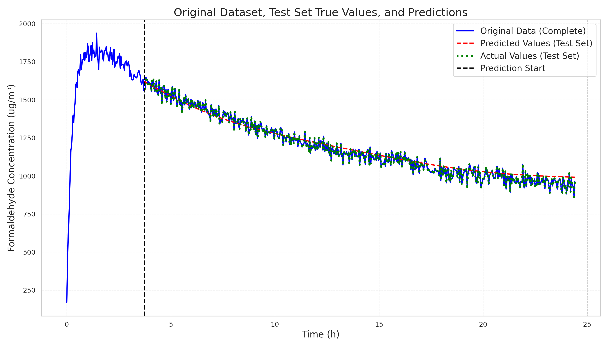

# Simple Sequence Prediction

| One-Step(Batch) | Multi-Step(Regressive) |
|:---------------:|:-----------------------:|
|  |  |

This project implements several sequence prediction models with PyTorch. The task is to predict formaldehyde concentration based on time.

The project utilizes two datasets **w+y.csv** and **y+w.csv** ("White + Yellow" and "Yellow + White"), which contain two columns of  `time(h)` and `formaldehyde(ug/m³)`. Both datasets are located in the `data` directory.

### Project Structure

```bash
tree -I '__pycache__|.git|logs|multirun|images|__init__.py' --dirsfirst
.
├── conf                         # Configuration directory using Hydra
│   ├── dataset                  # Dataset configurations
│   │   ├── w_y.yaml             # Config for white+yellow dataset
│   │   └── y_w.yaml             # Config for yellow+white dataset
│   ├── hydra                    # Hydra-specific configurations
│   │   └── default.yaml         # Default Hydra settings
│   ├── logger                   # Logging configurations
│   │   └── default.yaml         # Default logger settings
│   ├── model                    # Model configurations
│   │   ├── lstm_linear1.yaml    # Config for simple LSTM model
│   │   └── lstm_linear2.yaml    # Config for LSTM with extended linear layers
│   ├── train                    # Training configurations
│   │   └── default.yaml         # Default training parameters
│   └── default.yaml             # Root configuration file
├── data                         # Data directory
│   ├── w+y.csv                  # White+yellow experiment data
│   └── y+w.csv                  # Yellow+white experiment data
├── docs                         # Documentation directory
│   └── 20241219.md              # Development notes and results
├── src                          # Source code directory
│   ├── model                    # Model implementations
│   │   ├── base.py              # Base LSTM model class
│   │   ├── lstm_linear1.py      # Simple LSTM implementation
│   │   ├── lstm_linear2.py      # Extended LSTM implementation
│   │   └── utils.py             # Model utility functions
│   ├── utils                    # Utility functions
│   │   ├── data.py              # Data processing utilities
│   │   ├── logger.py            # Logging utilities
│   │   └── plot.py              # Plotting utilities
│   ├── data.py                  # Dataset and dataloader implementations
│   └── train.py                 # Training loop implementation
├── predict.py                   # Prediction script
├── README.md                    # Project documentation
├── requirements.txt             # Project dependencies
├── run.sh                       # Training automation script
└── train.py                     # Main training entry point
```

### Setup

1. Clone the repository:
   ```
   git clone https://github.com/donglinkang2021/simple-sequence-prediction.git
   cd simple-sequence-prediction
   ```

2. Install the required dependencies:
   ```
   pip install -r requirements.txt
   ```

### License

This project is licensed under the MIT License.
