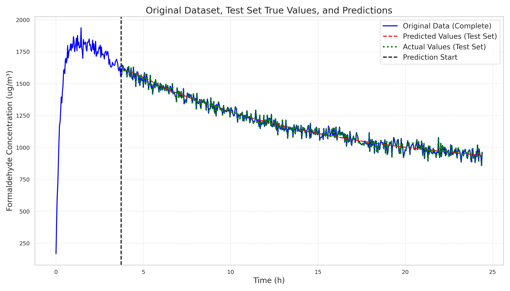

<div align="center">

# Simple Sequence Prediction


</div>

<div align=center>
   
</div>

This project implements several sequence prediction models with PyTorch. The task is to predict formaldehyde concentration based on time.


### Setup

1. Clone the repository:
   
   ```bash
   git clone https://github.com/donglinkang2021/simple-sequence-prediction.git
   cd simple-sequence-prediction
   ```

2. Install the required dependencies:
   
   ```bash
   python3 -m venv venv
   source venv/bin/activate
   pip install -r requirements.txt
   ```

### Usage

To train the model, run the following command:

```bash
# recommend to remove all logs before running
# rm -rf logs # remove all logs
# also recommend use tmux to run the following scripts
bash scripts/run_lstm.sh # simple baseline
bash scripts/run_att.sh # attention mechanism
bash scripts/run_att_mh.sh # multi-head attention mechanism
bash scripts/run_vq.sh # vector quantization mlp
bash scripts/run_vq_mh.sh # vector quantization multi-head mlp
tensorboard --logdir=logs --bind_all # start tensorboard
python scripts/search_tb_event.py # search the best result from tensorboard event files
```

If you want to train on multi-windows using `tmux`(multi GPU) once, you can refer to the following command:

```bash
bash scripts/run_tmux.sh
```

You can copy the best model name to `scripts/predict.sh`, run the following command:

```bash
bash scripts/predict.sh
# or just run the following command
python predict.py --model_name att_mh_y_w_ts112_lr0.0003/2025-01-10-23-15-54
```

### License

This project is licensed under the MIT License.
