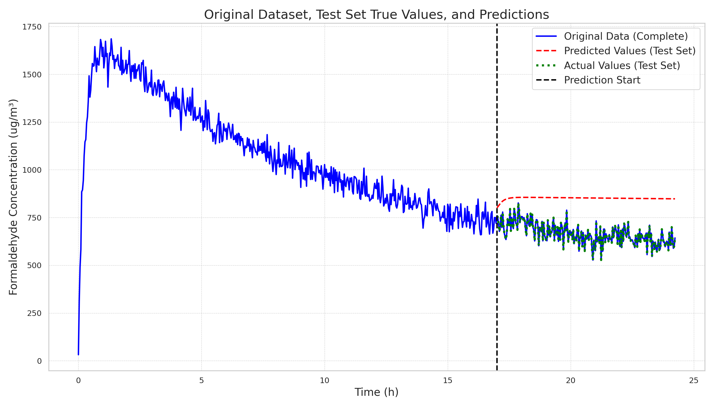
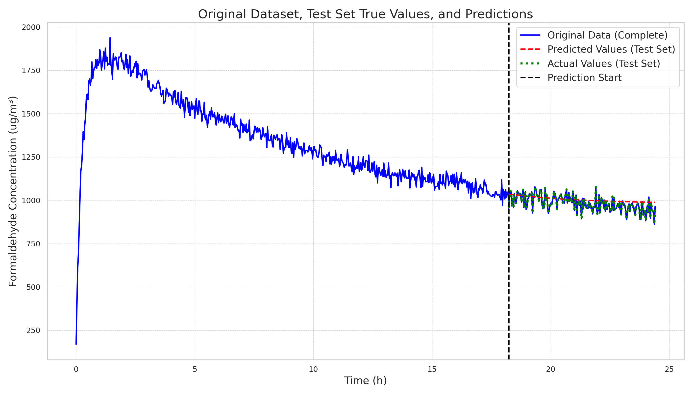
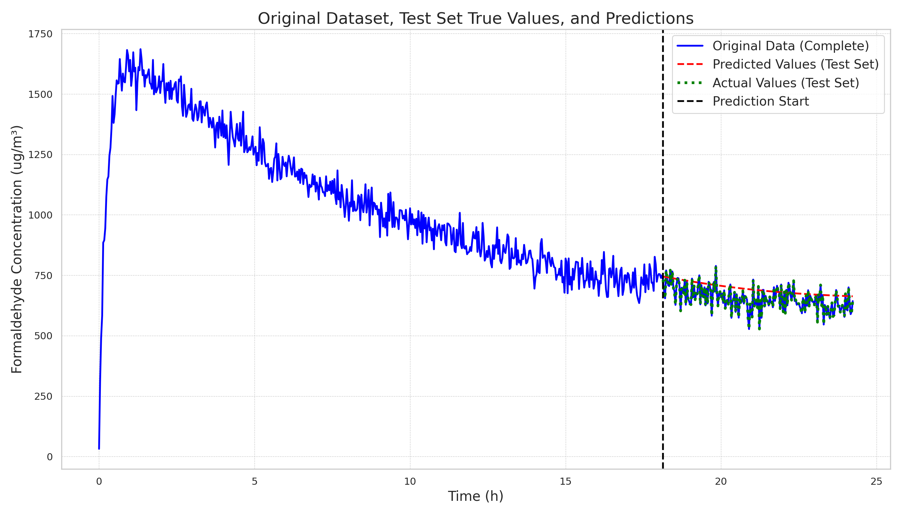

# 20241219

The code framework is basically set up, but I am not very satisfied with the final result. I feel it is due to the input and output dimensions of the LSTM not being well handled:

1. Currently, the time dimension and the dimension of the variable to be predicted are concatenated together, but this does not work well. According to the transformer approach, they should actually be added directly because time is equivalent to a global position embedding, not a feature.
2. For the LSTM model to output multi-step predictions autoregressively (using the output as the input for the next step rather than using the true value as input), this ensures the model's autoregressive nature and long-term prediction capability. However, the results are not good, as shown in the figure below.
3. A trained sequence model inherently has generalization ability, so it can directly predict good results on unseen data. I trained on one sequence dataset and then predicted on another sequence dataset, and the results were quite good (able to predict the general trend).

| Dataset\Method | One-step prediction (Batch) | Multi-step prediction (Regressive) |
| -------------- | --------------------------- | ---------------------------------- |
| **y+w (trained)** |  |  |
| **w+y (unseen)** |  |  |

To summarize the next steps:

1. The generalization ability of small models on sequences is worth learning from. This gives a basic toy model that, after learning similar sequence trends, can predict reasonably well on unseen data.
2. Redesign the input to be single output, so the dimensions are consistent. Consider changing the time dimension to a position embedding to ensure the model's autoregressive nature.
3. The current best result is a valset 0.0121 MSE loss. The next step is to surpass this baseline.

After completing the first two points, the experimental results have already surpassed all previous baselines. Even though there is a slight issue with the MSE loss calculation, resulting in 0.0137, the single variable input has indeed achieved a significant improvement in performance, as shown in the figure below:

| Dataset\Method | One-step prediction (Batch) | Multi-step prediction (Regressive) |
| -------------- | --------------------------- | ---------------------------------- |
| **y+w (trained)** |  |  |
| **w+y (unseen)** |  |  |
