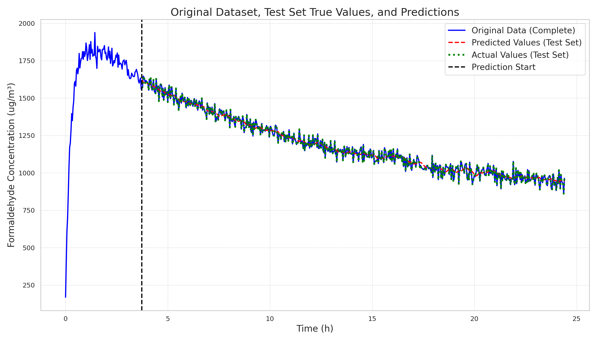

# 20241220

The latest experimental results are as follows:

| File                                                  |      Loss |
|-------------------------------------------------------|-----------|
| lstm_linear1_y_w_ts112_lr0.0005/2024-12-20-10-47-35   | **0.0137195** |
| vqmlp_vs32_dm8_y_w_ts96_lr0.007/2024-12-20-11-14-50   | **0.0263155** |
| vqmlp_vs256_dm4_y_w_ts96_lr0.003/2024-12-20-11-08-21  | 0.0263283 |
| vqmlp_vs512_dm4_y_w_ts96_lr0.007/2024-12-20-11-08-40  | 0.0263932 |
| vqmlp_vs32_dm8_y_w_ts112_lr0.005/2024-12-20-11-15-14  | 0.0263948 |

I wrote a simple version of the code using attention, the VQMLP version, and found that the model ultimately learned to output the last value of the input sequence. Therefore, the model did not learn the relative positional information, and position embedding needs to be added to solve this problem.

You can compare it with the previous best implementation:

| Model\Method | One-step prediction (Batch) | Multi-step prediction (Regressive) |
| -------------- | --------------------------- | ---------------------------------- |
| LSTM(**best**) |  |  |
| VQMLP |  |  |

Although it looks good in the batch prediction, it actually did not learn the sequence information at all, but only learned the last value of the input-output sequence. This is also why the sequence converges to a single value during regressive prediction.

The next step is to consider how to add local positional information, temporarily not considering global positional information.
