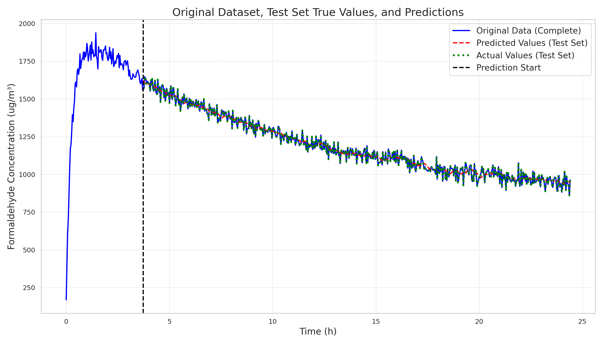
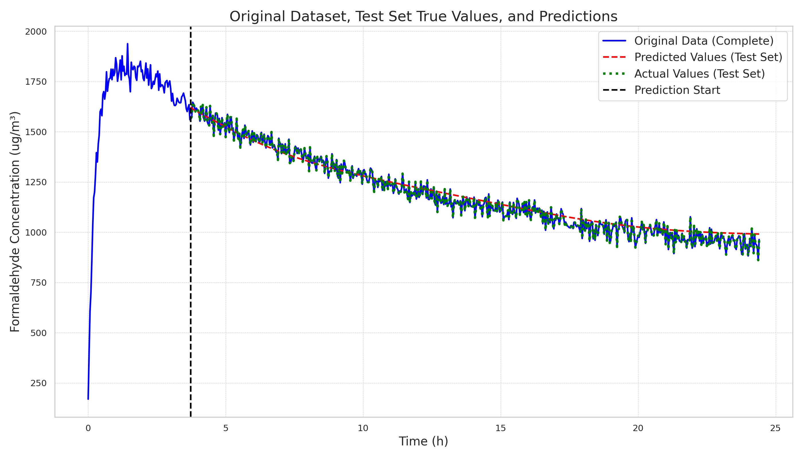
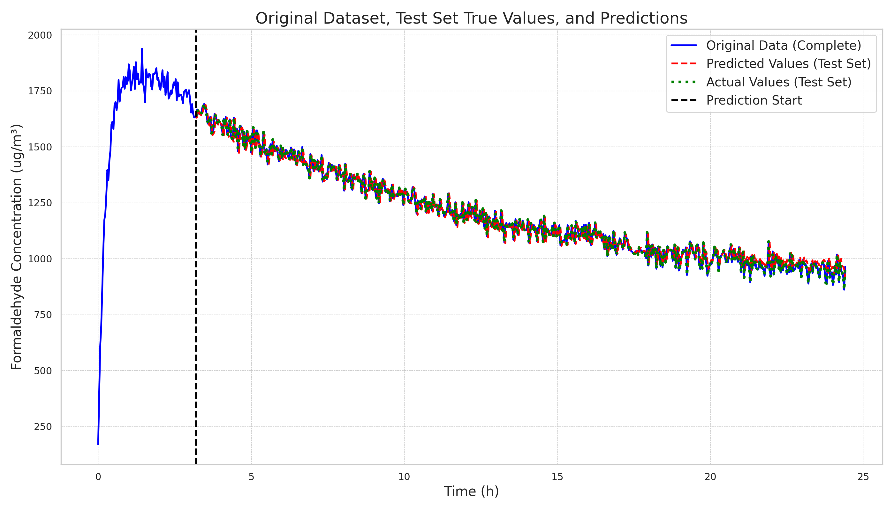

# 20241221

The latest experimental results are as follows:

| File                                                      |      Loss |
|-----------------------------------------------------------|-----------|
| lstm_linear1_y_w_ts112_lr0.0005/2024-12-20-22-23-02       | 0.0137326 |
| vqlnmlp_y_w_ts96_lr0.007/2024-12-20-22-23-13              | 0.0260275 |
| vqlnpemlp_vs512_dm32_y_w_ts96_lr0.007/2024-12-20-22-55-08 | 0.0262058 |
| vqlnpemlp_vs32_dm8_y_w_ts96_lr0.03/2024-12-20-22-50-38    | 0.026213  |
| vqlnpemlp_vs128_dm16_y_w_ts96_lr0.03/2024-12-20-22-52-42  | 0.0262191 |

| Model\Method | One-step prediction (Batch) | Multi-step prediction (Regressive) |
| -------------- | --------------------------- | ---------------------------------- |
| LSTM(**best**) |  |  |
| VQLNMLP(vocab_size32, dim8) |  |  |
| VQLNPEMLP(vocab_size512, dim32) |  |  |

The conclusions are:

1. Models with layer normalization perform better than those without it.
2. For position encoding, the added embedding standard deviation should be much smaller than the original encoded input standard deviation, otherwise, the model training becomes difficult.
3. Based on the previous point, even adding the simplest local positional encoding of 0.01 * randn achieves performance close to the initial model with only layer normalization.
4. As the vocabulary size increases, the model's long-term memory ability improves. This aligns with our previous thoughts that the MLP stores memory. However, by using VQ, we combine the computation (LLM MHA) and communication (LLM FFN) steps into one. Therefore, it makes sense to continue increasing the vocabulary size, but this will significantly increase memory usage.

To address the fourth point, three solutions and one goal are proposed for future work:

- Goal: Enhance the long-term memory ability (now called context length) of the basic MLP-like model to approach that of LSTM.
- Solution 1: Directly increase the vocabulary size to improve long-term memory and observe the effects.
- Solution 2: This method is similar to the GQA method used in LLaMA3 (multiple Qs correspond to one set of KV). Our VQ (multiple Qs correspond to one set of embedded K=V) can be understood as follows:
    - For example, with vocab_size=1024, there are 1024 encodings, each corresponding to an embed.
    - The codebook size is (1024, embed).
    - We can use grouping to allow fewer encodings to index more embeds.
    - By splitting the embed into two parts (two heads, each with dim=embed/2), one head uses a codebook of size (32, embed/2) and the other uses another codebook of size (32, embed/2).
    - 1024 = 32 * 32, thus fewer encodings can index more embeds, significantly reducing memory and parameter usage (32 * 2 / 1024 = 6.25%). For a more extreme example, 512 = 8 * 8 * 8, 24 / 512 = 4.69%.
- Solution 3:
    - Similar to Solution 2, but operates on the T dimension of (B, T, D) (temporal locality).
    - VQ aims to group similar embeds in the T dimension, allowing direct use of encodings (B, T) to obtain corresponding embeds (B, T, D).
    - This can be seen as a soft cache, reducing cache size. However, caches are hierarchical, so if L1 cache misses, it should access L2, then L3.
    - From an information exchange perspective, the initial VQ form was proposed to manage node information exchange via codebooks (cache). Higher-level nodes can exchange information before codebooks do. The size of the next-level vocab_size needs consideration (whether codebooks exchange information first or input and codebooks do).
    - vocab_size inc: input = 4096, L1cache = 32, L2cache = 128, L3cache = 512: L3 exchanges with L2, L2 with L1, L1 with input.
    - vocab_size dec: L1cache = 512, L2cache = 128, L3cache = 32: input exchanges with L1, L1 with L2, L2 with L3.

Examples to solve long-term memory problem in MLP:
- original: input(B, 4096, D) codebook(512, D)
- method1: input(B, 4096, D) codebook(1024, D)
- method2: input(B, 4096, D) codebook_1(32, D/2) codebook_2(32, D/2)
- method3: input(B, 4096, D) codebook1(1024, D) codebook2(256, D) codebook3(32, D)
- method2+3: input(B, 4096, D)
    - codebook1_1(4, D/5) codebook1_2(4, D/5) codebook1_3(4, D/5) codebook1_4(4, D/5) codebook1_5(4, D/5)
    - codebook2_1(16, D/2) codebook2_2(16, D/2)
    - codebook3(32, D)
