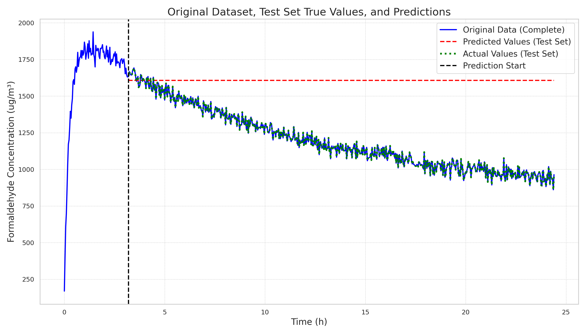
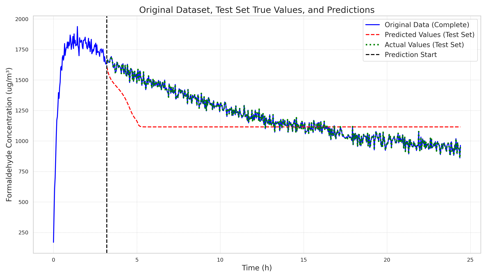
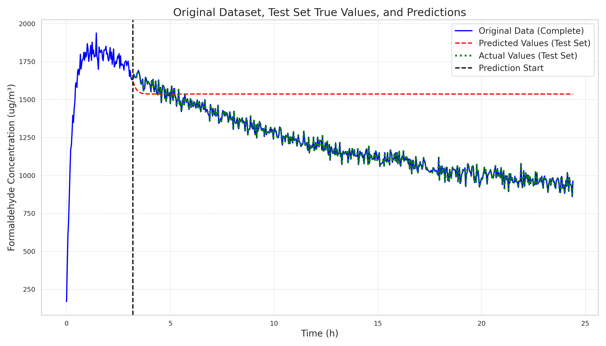

# 20241222

| File                                                             |      Loss |
|------------------------------------------------------------------|-----------|
| mhvqlnmlp_vs768_dm32_nh16_y_w_ts96_lr0.01/2024-12-21-17-20-20    | 0.024347  |
| mhvqlnmlp_vs64_dm32_nh16_y_w_ts96_lr0.01/2024-12-21-17-06-43     | 0.0244761 |
| mhvqlnmlp_vs512_dm32_nh16_y_w_ts96_lr0.007/2024-12-21-17-18-04   | 0.0245155 |
| mhvqlnmlp_vs256_dm32_nh16_y_w_ts96_lr0.007/2024-12-21-17-16-01   | 0.0245313 |
| mhvqlnmlp_vs32_dm32_nh16_y_w_ts96_lr0.003/2024-12-21-17-06-51    | 0.0246295 |

| File                                                              |      Loss |
|-------------------------------------------------------------------|-----------|
| mhvqlnpemlp_vs768_dm128_nh16_y_w_ts96_lr0.007/2024-12-21-17-08-13 | 0.0252554 |
| mhvqlnpemlp_vs128_dm64_nh16_y_w_ts96_lr0.01/2024-12-21-17-00-40   | 0.0252858 |
| mhvqlnpemlp_vs128_dm512_nh16_y_w_ts96_lr0.03/2024-12-21-17-09-08  | 0.0253004 |
| mhvqlnpemlp_vs1024_dm128_nh16_y_w_ts96_lr0.01/2024-12-21-17-09-52 | 0.02532   |
| mhvqlnpemlp_vs768_dm64_nh16_y_w_ts96_lr0.007/2024-12-21-17-02-01  | 0.0253341 |

Continuing from the previous day's work on Method Two, here are the latest results:

1. Using the multi-head approach in Method Two generally performs better than not using it. Moreover, the more heads used, the better the final performance, which aligns with our hypothesis (fewer codebooks can represent more vocab_size, and more heads mean more embeddings can be represented).
2. The effect of not adding positional encoding (PE) generally results in a lower validation MSE loss compared to adding PE. However, in multi-step regressive tasks, the performance without PE is generally worse than with PE. The validation MSE loss is only a standard during training, indicating that it enhances overfitting on the training set. This further emphasizes the importance of considering spatial information (adding PE is the correct choice).

Below, the actual performance of the five models on the regressive task illustrates the second point:

| mhvqlnmlp(top5) | mhvqlnpemlp(top5) |
|-----------|-------------|
|  |  |
|  |  |
|  |  |
|  |  |
|  |  |

Next Steps

1. Consider adding causal attention. The current vq series models have a drawback in that they do not apply the concept of causality. It might be worth trying the original attention mechanism with causal ideas.
2. Improve the current position encoding. The current position encoding is randomly generated. Consider using the transformer2017 PE and RoPE to see if there is better performance for long sequences.
3. Temporarily put Method Three on hold. Since the results of Method Two have not yet met expectations, continue optimizing Method Two first.
