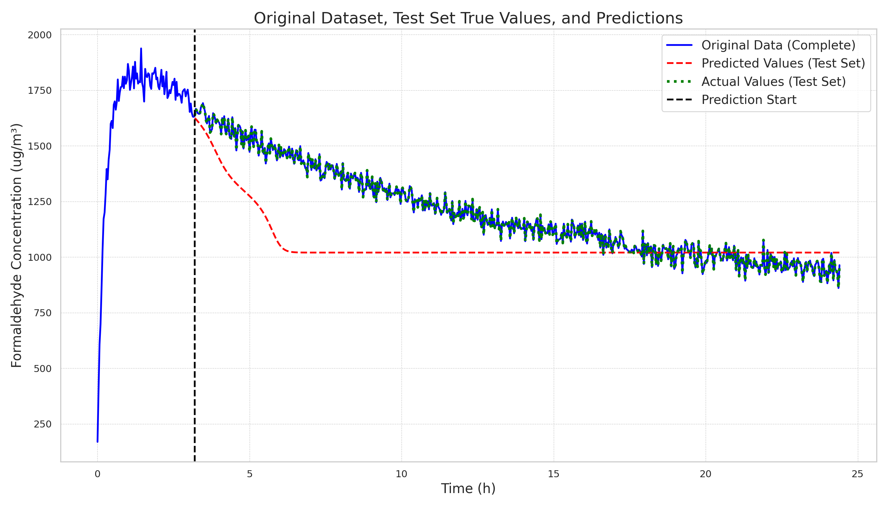
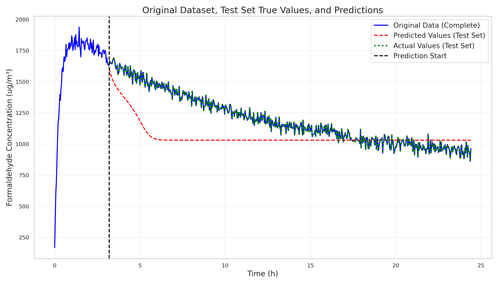
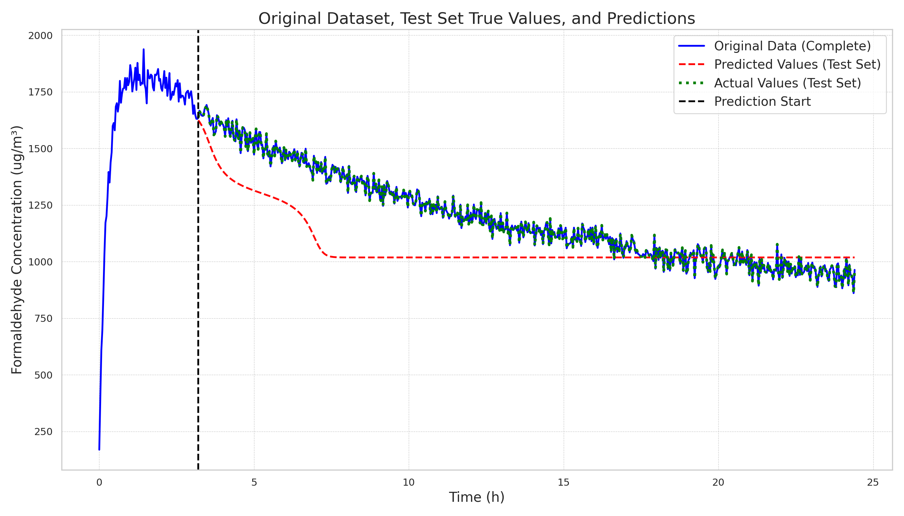

# 20241223

Current results show significant improvements without parameter tuning. The latest results are as follows:

| File                                                                |      Loss |
|---------------------------------------------------------------------|-----------|
| mhvqlnmlp_rope_vs512_dm64_nh8_y_w_ts96_lr0.007/2024-12-23-00-04-22  | 0.0255627 |
| mhvqlnmlp_vs512_dm64_nh2_y_w_ts96_lr0.007/2024-12-23-00-04-12       | 0.025994  |
| mhvqlnpemlp_vs512_dm64_nh2_y_w_ts96_lr0.007/2024-12-23-00-04-16     | 0.0261349 |
| vqlnmlp_rope_vs512_dm64_y_w_ts96_lr0.007/2024-12-23-00-05-26        | 0.0261638 |
| vqlnmlp_vs512_dm64_y_w_ts96_lr0.007/2024-12-23-00-05-16             | 0.0262299 |
| vqlnpemlp_vs512_dm64_y_w_ts96_lr0.007/2024-12-23-00-05-20           | 0.0263118 |
| vqlnmlp_sinpe_vs512_dm64_y_w_ts96_lr0.007/2024-12-23-00-05-23       | 0.0263636 |
| mhvqlnmlp_sinpe_vs512_dm64_nh8_y_w_ts96_lr0.007/2024-12-23-00-04-19 | 0.0266329 |

| Model | Original | +RandnPE | +SinPE | +RoPE | 
|-------|----------|----------|--------|-------|
| VQLNMLP | 0.0262299 | 0.0263118 | 0.0263636 | **0.0261638** |
| MHVQLNMLP | 0.025994 | 0.0261349 | 0.0266329 | **0.0255627** |

The MSE predictions and actual results for the regressive task are as follows:

| Model | Original | +RandnPE | +SinPE | +RoPE |
|-------|----------|----------|--------|-------|
| VQLNMLP | 40395.99251109407 | 37311.36094459 | 43374.69117526042 | **19314.00228170907** |
| MHVQLNMLP | 32116.378231528608 | **19412.36052057736** | 37210.76253016894 | 65849.38500299986 |

| Model | Original | +RandnPE | +SinPE | +RoPE | 
|-------|----------|----------|--------|-------|
| VQLNMLP |  |  |  |  |
| MHVQLNMLP |  |  |  |  |

In summary, RoPE has achieved good results. With multi-head attention, we can visually see improvements compared to single-head performance across Original, RandnPE, and SinPE. However, RoPE may have prediction issues (requiring KVCache-like inference). Future directions (temporarily pausing updates):

1. Improve sequence prediction for models with SinPE and RoPE by potentially introducing start_pos
2. Implement KVCache-like inference to better utilize RoPE's characteristics
3. Add causal mask to better utilize sequence properties
4. Consider implementing method three, which involves increasing network depth while considering attention mechanisms

