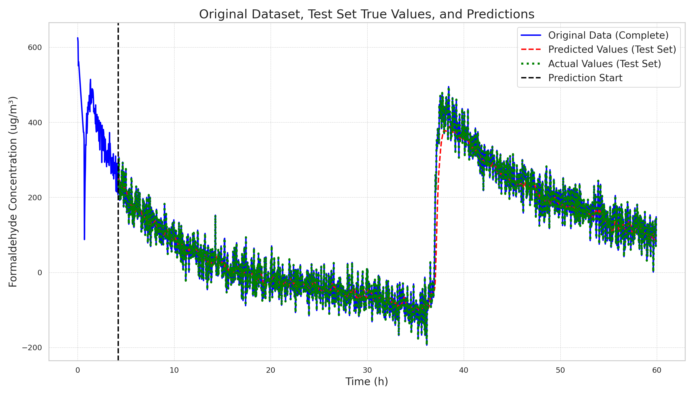
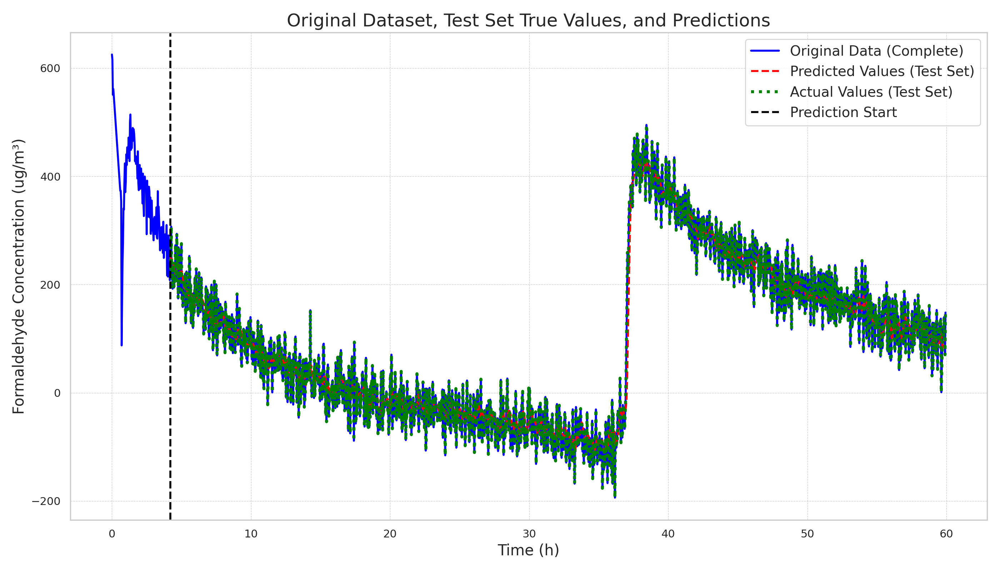
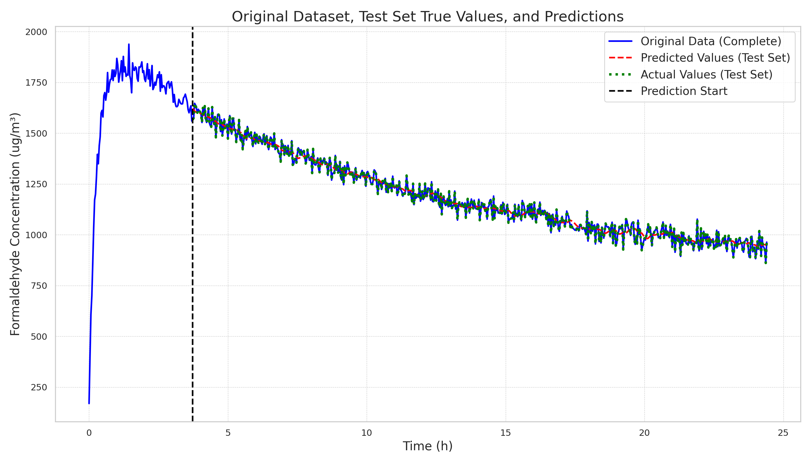
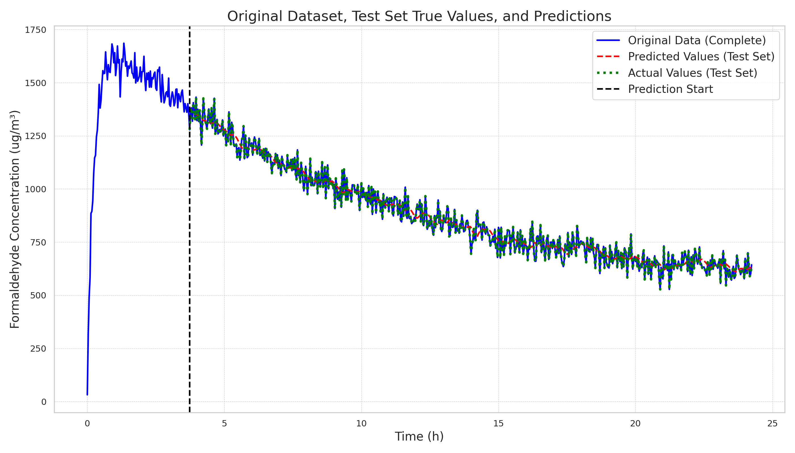
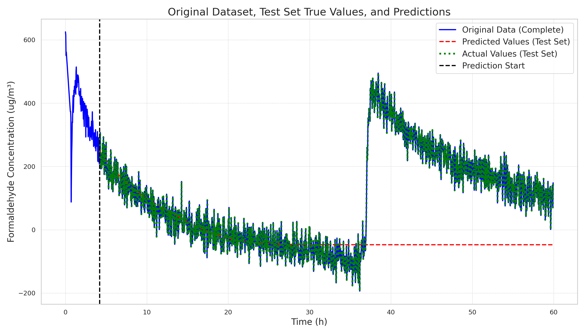
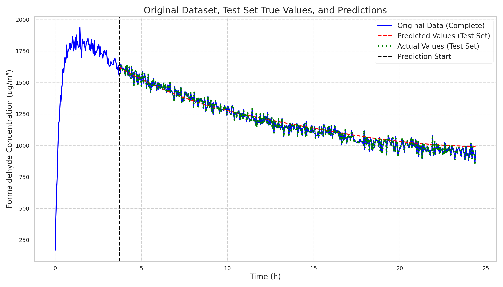
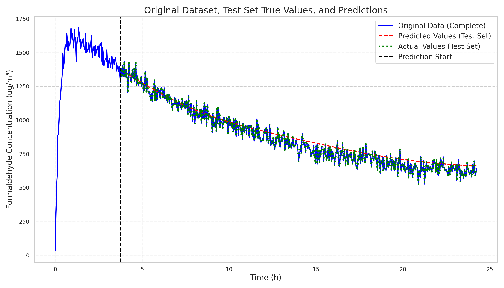

# 20250106

> This experiment was conducted before 12.31, with a new dataset added, using the previously better model LSTM to make new predictions.

Tests were conducted on the new dataset 4single using two methods:

1. Using the best model trained on the initial dataset y_w to directly predict 4single.
2. Using the model trained on the new dataset 4single to predict 4single.

| Method\Trainset-Testset  | y_w-4single | 4single-4single | y_w-y_w | y_w-w_y |
| ------------------------ | ----------- | --------------- | ------- | ------- |
| Batch (input is original value) |  |  |  |  |
| Regressive (add predicted value to input) |  |  |  |  |

From the results above, it can be seen that using the model trained on y_w to predict 4single performs better in the regressive method compared to using the model trained on 4single to predict 4single. This is largely because the data in y_w is more stable, allowing for smoother predictions, whereas the data in 4single has larger fluctuations (with a periodic peak), leading to noticeable deviations in predictions.

> Only the regressive method is making truly long-term predictions.

The next steps are:

1. Implement method three, achieving cascaded cache VQ.
2. Alternatively, directly implement attention with linear mapping for KV, which will diverge from the initial VQ model. This will enable interaction between tokens, and the benefits include the ability to use casual, KVCache, and other operations, making it quite convenient.