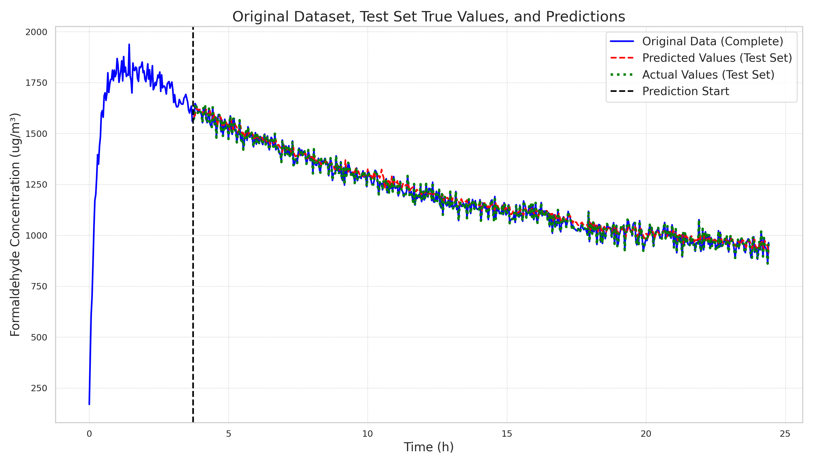
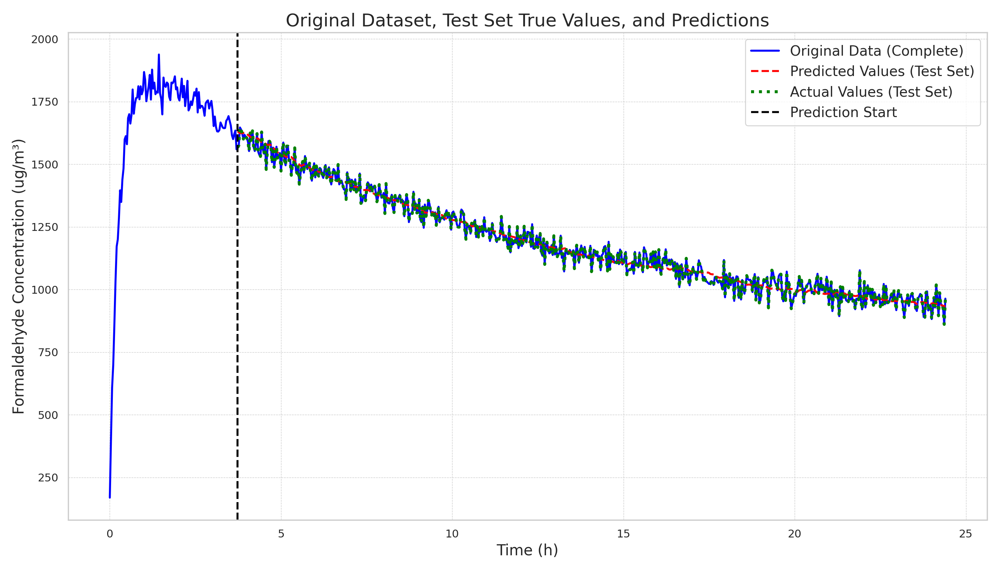
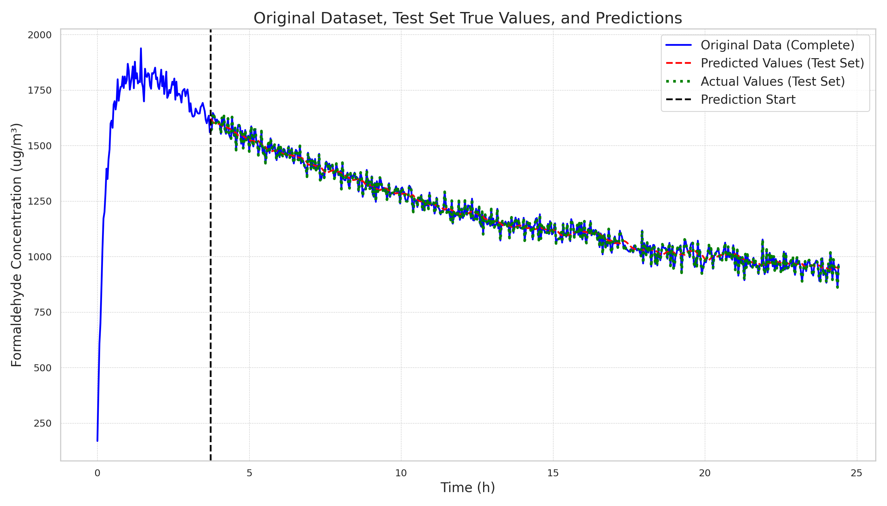
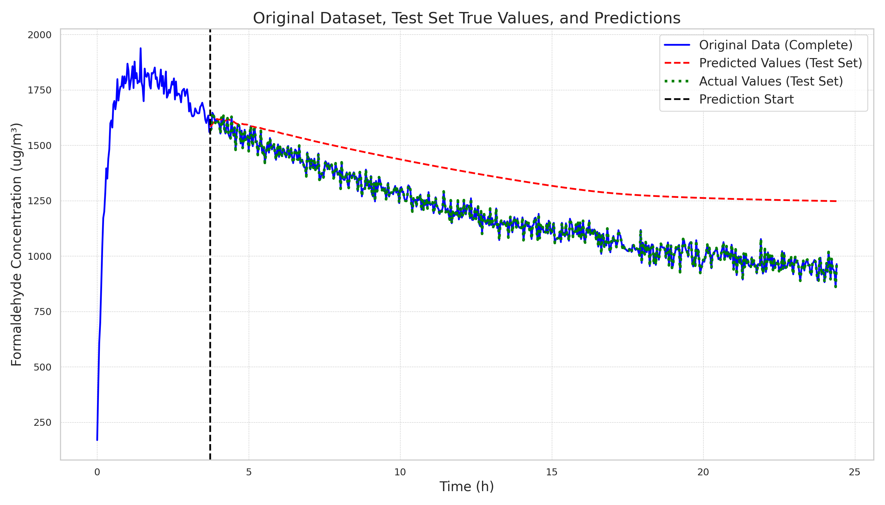
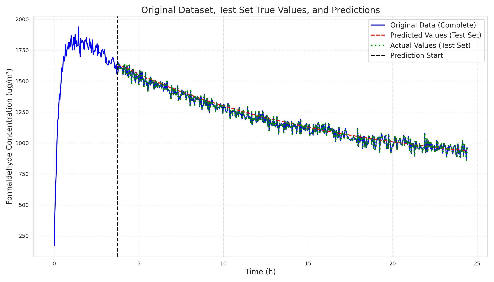

# 20250110

```bash
python train.py --multirun \
  train.is_align_target=True \
  model=att \
  dataset=y_w \
  model.is_inln=true,false \
  model.is_qln=true,false \
  model.is_kln=true,false \
  model.is_causal=true,false \
  model.pe_type=none,randpe,sinpe,rope \
  train.learning_rate=1e-3,3e-4,5e-5 \
  train.time_steps=112 \
  train.batch_size=64
```

Below shows the best results (top 5)

| File | Val Loss(train) | Total MSE(Predict Batch) | Total MSE(Predict Regressive) |
|------|-----------------|--------------------------|-------------------------------|
| att_y_w_ts112_lr0.001/2025-01-10-19-00-24 | **0.00981582** | 1295.818368942641 | 42828.824301408036 |
| att_y_w_ts112_lr0.001/2025-01-10-19-00-18 | 0.0134654 | 1113.7149305998546 | **1354.1780116791986** |
| att_y_w_ts112_lr0.001/2025-01-10-19-01-02 | 0.0134917 | 1117.0031215234053 | 4745.631805489277 |
| att_y_w_ts112_lr0.0003/2025-01-10-19-00-26 | 0.0136115 | 1188.3733263472545 | 41165.7349524749 |
| lstm_y_w_ts112_lr0.0005/2025-01-10-19-31-16 | 0.0136644 | **1106.5893053490058** | 1546.9133038721288 |

Experiment results explanation:

- Training parameters for `2025-01-10-19-00-24`:

```yaml
model:
  _target_: src.model.att.Model
  d_model: 64
  input_dim: 1
  output_dim: 1
  block_size: 512
  is_inln: false
  is_qln: true
  is_kln: true
  is_causal: false
  pe_type: rope
dataset:
  train_file: data/y+w.csv
train:
  time_steps: 112
  num_epochs: 50
  learning_rate: 0.001
  batch_size: 64
  is_random_split: true
  is_align_target: true
...
```

- Training parameters for `2025-01-10-19-00-18`:

```yaml
model:
  _target_: src.model.att.Model
  d_model: 64
  input_dim: 1
  output_dim: 1
  block_size: 512
  is_inln: false
  is_qln: true
  is_kln: true
  is_causal: false
  pe_type: sinpe
dataset:
  train_file: data/y+w.csv
train:
  time_steps: 112
  num_epochs: 50
  learning_rate: 0.001
  batch_size: 64
  is_random_split: true
  is_align_target: true
...
```

Quick feedback and next steps:

1. Implemented basic attention mechanism. From the last column of the table, we can see that adding sinpe achieves better regressive prediction performance than the best LSTM val loss, and non-causal attention performs better than causal attention.
2. Found an issue with RoPE implementation - the current attention version only considers adding PE to the input before mapping, but RoPE should be added to Q and K. This needs to be fixed.
3. Even with this implementation issue, RoPE achieved the lowest val loss during training, significantly better than the second-best.
4. Discovered that applying layernorm separately to input before mapping or to Q after mapping is not as effective as applying layernorm to both Q and K simultaneously.
5. In this new prediction version, the model is actually learning to predict rather than simply repeating the last sequence value to minimize loss (which was the case with previous simple MLPs).

| Method\Model | att_y_w_ts112_lr0.001(input_rope, qk_norm) | att_y_w_ts112_lr0.001(input_sinpe, qk_norm) | lstm_y_w_ts112_lr0.0005(lstm) |
|-------------|-------------------------------------------|-------------------------------------------|---------------------------------------------|
| Batch |  |  |  |
| Regressive |  |  |  |

Next steps:

- [x] Create a comparison table with all three plots
- [x] Add RoPE PE to Q and K
- [x] Narrow down parameter ranges and rerun experiments
- [x] Include prediction metrics in train.py

```bash
rm -rf logs # remove all logs
bash scripts/run_lstm.sh # last best baseline
bash scripts/run_att.sh # focus on this script
tensorboard --logdir=logs --bind_all
python scripts/search_tb_event.py # search the best result from tensorboard event files
```

> Note: Current experimental results all outperform the basic LSTM with fewer parameters

Updated results shown below, based on today's findings:

1. For the best-performing models, the location of layernorm seems less critical - having layernorm anywhere appears beneficial
2. Most top-ranking results include is_causal, proving that causality helps model reasoning
3. Based on point 2, we should consider ranking each parameter's importance for proper ablation studies
4. Ablation studies should be conducted separately for each model type (att or att_mh)
5. Tomorrow morning we can analyze which parameters are most effective and use this to explain model behavior

| Model                                                                                                               |   Predict/mse_batch |   Predict/mse_regressive |   Final/train_loss |   Final/val_loss |
|---------------------------------------------------------------------------------------------------------------------|---------------------|--------------------------|--------------------|------------------|
| [att_mh-64-8-1-1-1-512-is_kln-is_causal-sinpe](./logs/att_mh_y_w_ts112_lr0.0003/2025-01-10-23-15-54)                |             1088.57 |                  1082.98 |          0.0263789 |        0.022272  |
| [att-64-1-1-512-is_inln-is_qln-is_kln-is_causal-sinpe](./logs/att_y_w_ts112_lr0.003/2025-01-10-23-06-46)            |             1115.52 |                  1098.24 |          0.0179147 |        0.0163662 |
| [att-64-1-1-512-is_inln-is_causal-rope](./logs/att_y_w_ts112_lr0.001/2025-01-10-23-15-24)                           |             1210.19 |                  1104.77 |          0.0224585 |        0.0211341 |
| [att-64-1-1-512-is_kln-is_causal-sinpe](./logs/att_y_w_ts112_lr0.003/2025-01-10-23-23-19)                           |             1112.8  |                  1107.14 |          0.0165655 |        0.0154276 |
| [att-64-1-1-512-is_qln-is_kln-is_causal-sinpe](./logs/att_y_w_ts112_lr0.001/2025-01-10-23-17-59)                    |             1108.76 |                  1107.6  |          0.0170964 |        0.0156644 |
| [att_mh-64-8-8-1-1-512-is_qln-is_kln-is_causal-sinpe](./logs/att_mh_y_w_ts112_lr0.0003/2025-01-10-23-39-10)         |             1112.06 |                  1128.91 |          0.0174362 |        0.0158412 |
| [att_mh-64-8-8-1-1-512-is_kln-is_causal-sinpe](./logs/att_mh_y_w_ts112_lr0.0003/2025-01-10-23-41-01)                |             1103.78 |                  1132.56 |          0.0175932 |        0.0155773 |
| [att-64-1-1-512-is_qln-is_kln-is_causal-sinpe](./logs/att_y_w_ts112_lr0.003/2025-01-10-23-17-56)                    |             1106.8  |                  1153    |          0.0166246 |        0.0153081 |
| [att_mh-64-8-8-1-1-512-is_inln-is_kln-is_causal-sinpe](./logs/att_mh_y_w_ts112_lr0.0003/2025-01-10-23-37-17)        |             1110.99 |                  1171.78 |          0.019602  |        0.0169783 |
| [att-64-1-1-512-is_inln-is_qln-is_causal-rope](./logs/att_y_w_ts112_lr0.003/2025-01-10-23-09-45)                    |             1133.07 |                  1178.33 |          0.0198252 |        0.0177667 |
| [att-64-1-1-512-is_qln-is_causal-sinpe](./logs/att_y_w_ts112_lr0.003/2025-01-10-23-20-37)                           |             1077.52 |                  1181.7  |          0.0166504 |        0.0153735 |
| [att-64-1-1-512-is_inln-is_kln-is_causal-sinpe](./logs/att_y_w_ts112_lr0.0005/2025-01-10-23-12-33)                  |             1175.81 |                  1186.79 |          0.0182631 |        0.0165445 |
| [att-64-1-1-512-is_inln-is_qln-is_causal-rope](./logs/att_y_w_ts112_lr0.001/2025-01-10-23-09-49)                    |             1239.97 |                  1192.09 |          0.0215185 |        0.0200766 |
| [att-64-1-1-512-is_kln-is_causal-sinpe](./logs/att_y_w_ts112_lr0.001/2025-01-10-23-23-22)                           |             1132.9  |                  1192.38 |          0.0171684 |        0.0156251 |
| [att-64-1-1-512-is_inln-is_qln-is_kln-is_causal-rope](./logs/att_y_w_ts112_lr0.003/2025-01-10-23-06-57)             |             1165.29 |                  1197.14 |          0.0211092 |        0.0188245 |
| [att-64-1-1-512-is_inln-is_qln-is_kln-is_causal-sinpe](./logs/att_y_w_ts112_lr0.0005/2025-01-10-23-06-53)           |             1081.45 |                  1208.75 |          0.0203792 |        0.017496  |
| [att-64-1-1-512-is_inln-is_kln-is_causal-rope](./logs/att_y_w_ts112_lr0.001/2025-01-10-23-12-41)                    |             1208.81 |                  1216.31 |          0.0225856 |        0.0211647 |
| [att-64-1-1-512-is_qln-is_causal-sinpe](./logs/att_y_w_ts112_lr0.001/2025-01-10-23-20-40)                           |             1106.78 |                  1222.75 |          0.016907  |        0.015437  |
| [att_mh-64-8-4-1-1-512-is_inln-is_qln-is_kln-is_causal-sinpe](./logs/att_mh_y_w_ts112_lr0.0003/2025-01-10-23-26-38) |             1128.1  |                  1243.07 |          0.0207171 |        0.0178645 |
| [att-64-1-1-512-is_inln-is_qln-is_kln-sinpe](./logs/att_y_w_ts112_lr0.001/2025-01-10-23-07-33)                      |             1136.95 |                  1245.11 |          0.0149197 |        0.0142874 |

