# 20250111

Re-evaluated the rank of each parameter based on avg_rank to determine which parameter or parameter combination is most important.

Lessons Learned:

1. Before running large-scale experiments, ensure single examples run successfully. After debugging single runs, multi-runs will work smoothly.
2. All models were trained on one dataset (y_w) and tested on different datasets (y_w, w_y, 4single), achieving good results across the board.
3. Across all models, att_mh performed best, followed by att. Both outperformed traditional lstm. However, vq and vq_mh did not perform as well.
4. Based on regressive task performance in the appendix, parameters and combinations were ranked by avg_rank, revealing several key points:
    - `is_causal` proved very important in superior models like att and att_mh, validating our previous weeks' hypothesis. This enables true decoder-only inference, predicting forward without backward error propagation.
    - For positional encoding: sinpe > rope > none == randpe. This differs from previous assumptions, possibly due to the sequence task initially using direct linear mapping of discrete values. rope requires is_n_pe=True to be effective (adding to later qk, potentially dropping some features), while sinpe works well adding directly after initial input linear layer.
    - For layernorm, rank differences between inln, qln and kln were small, but top 10 models all used layernorm. In att: q_ln > k_ln > in_ln, while in att_mh: k_ln > q_ln > in_ln.
    - For gqa, it proved effective - in small models kv_heads=1 > 2 > 4 > 8, demonstrating benefits of weight sharing.
    - For vocab_size, larger was better in vq and vq_mh, showing larger vocab_size better expresses features. However, kv_heads showed opposite pattern - larger was better, consistent with [Method 2](./20241221.md). More vq can represent more embeds.
    - For pe_type in vq and vq_mh: rope > randpe > sinpe > none. This may relate to model characteristics - as non-self-attention regression, rope enriches original features better. is_causal remains effective even with fixed vocab_size sequences.

Current optimal prediction metrics for all four models shown [here](./images/20250111/table.pdf):

<div align="center">
    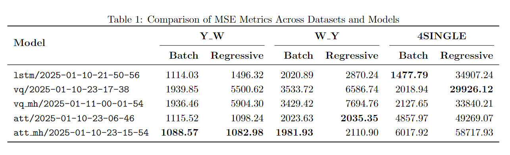
</div>

## Appendix 

Below records actual prediction results, training scripts, and parameter ranks for each model.

> For discussing parameter ranks, cases where param = False were manually removed since parameters clearly function when param = True. Including False cases would complicate analysis without adding value. See `iter_pairs_kd` function in `scripts/search_tb_event.py`.

### lstm

| Method\Testset | y_w | w_y | 4single |
|----------------|-----|-----|---------|
| Batch | 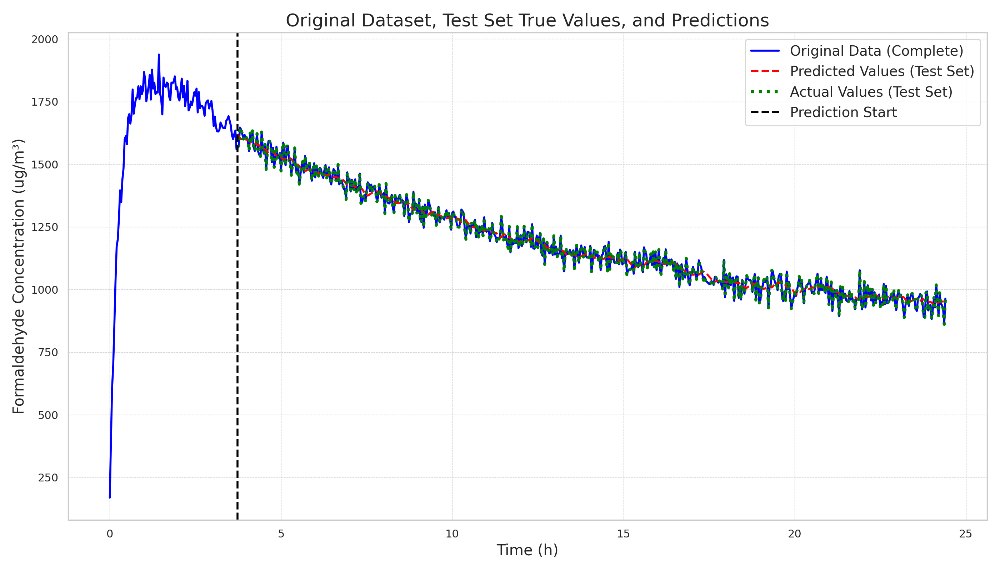 |  | 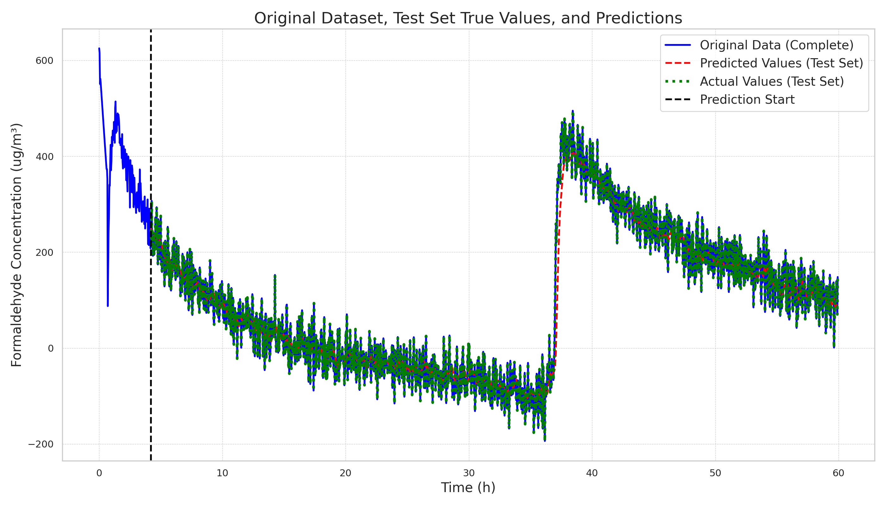 |
| Regressive |  |  | 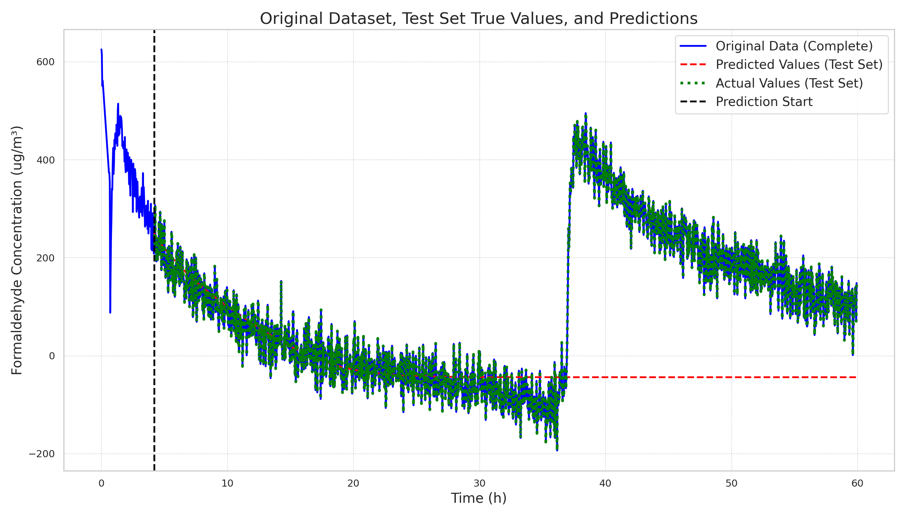 |

```bash
# last time 
# best model
# min mse is 0.0137 on lstm
python train.py \
    model=lstm \
    dataset=y_w \
    model.hidden_dim=64 \
    train.learning_rate=5e-4 \
    train.time_steps=112 \
    train.batch_size=64
```

| Model                                                               |   Predict/mse_regressive |   Predict/mse_batch |   Final/train_loss |   Final/val_loss |
|---------------------------------------------------------------------|--------------------------|---------------------|--------------------|------------------|
| [lstm-1-64-2-1](./logs/lstm_y_w_ts112_lr0.0005/2025-01-10-21-50-56) |                  1496.32 |             1114.03 |          0.0157653 |        0.0137661 |

### att

| Method\Testset | y_w | w_y | 4single |
|----------------|-----|-----|---------|
| Batch | 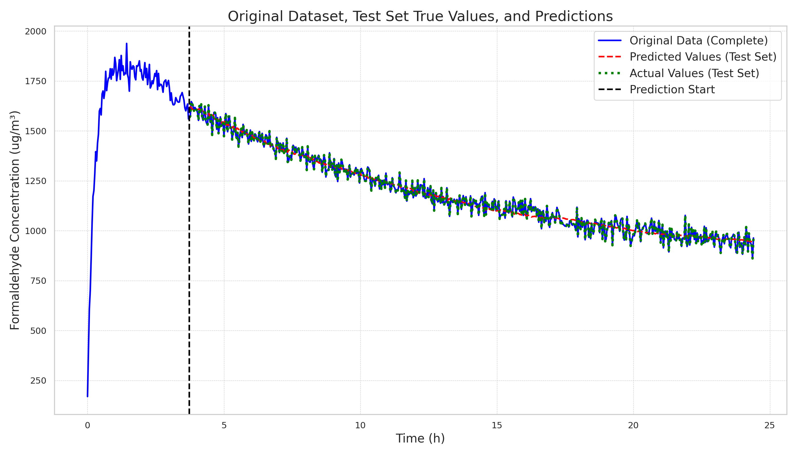 | 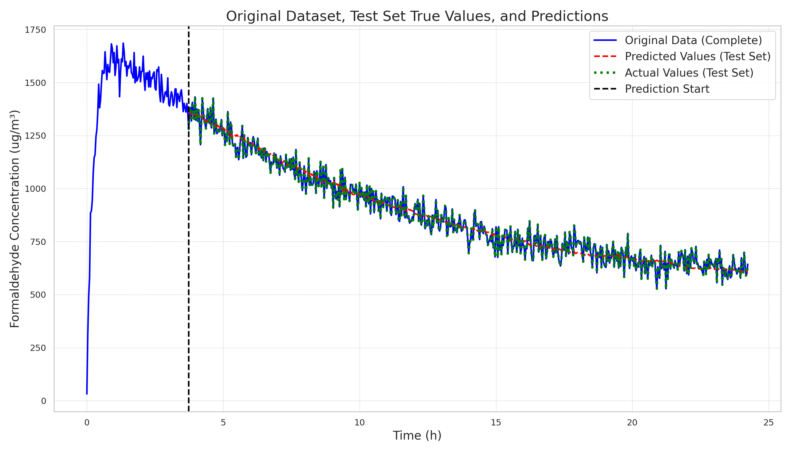 | 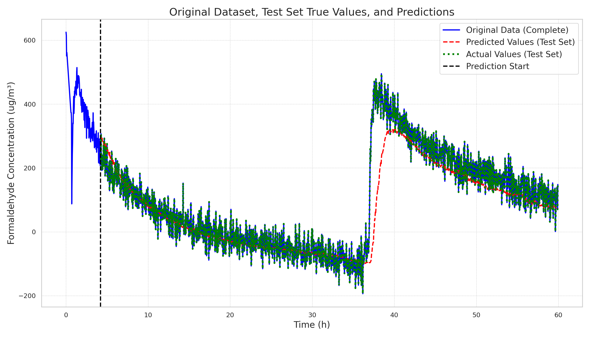 |
| Regressive |  |  |  |

```bash
# python train.py \
#     train.is_align_target=True \
#     model=att \
#     dataset=y_w \
#     train.learning_rate=5e-4 \
#     train.time_steps=112 \
#     train.batch_size=64

CUDA_VISIBLE_DEVICES=0 python train.py --multirun \
    train.is_align_target=True \
    model=att \
    dataset=y_w \
    model.is_inln=true,false \
    model.is_qln=true,false \
    model.is_kln=true,false \
    model.is_n_pe=true,false \
    model.is_causal=true,false \
    model.pe_type=none,randpe,sinpe,rope \
    train.learning_rate=3e-3,1e-3,5e-4 \
    train.time_steps=112 \
    train.batch_size=64
```

Found 416 event files.

| Model                                                                                                    |   Predict/mse_regressive |   Predict/mse_batch |   Final/train_loss |   Final/val_loss |
|----------------------------------------------------------------------------------------------------------|--------------------------|---------------------|--------------------|------------------|
| [att-64-1-1-512-is_inln-is_qln-is_kln-is_causal-sinpe](./logs/att_y_w_ts112_lr0.003/2025-01-10-23-06-46) |                  1098.24 |             1115.52 |          0.0179147 |        0.0163662 |
| [att-64-1-1-512-is_inln-is_causal-rope](./logs/att_y_w_ts112_lr0.001/2025-01-10-23-15-24)                |                  1104.77 |             1210.19 |          0.0224585 |        0.0211341 |
| [att-64-1-1-512-is_kln-is_causal-sinpe](./logs/att_y_w_ts112_lr0.003/2025-01-10-23-23-19)                |                  1107.14 |             1112.8  |          0.0165655 |        0.0154276 |
| [att-64-1-1-512-is_qln-is_kln-is_causal-sinpe](./logs/att_y_w_ts112_lr0.001/2025-01-10-23-17-59)         |                  1107.6  |             1108.76 |          0.0170964 |        0.0156644 |
| [att-64-1-1-512-is_qln-is_kln-is_causal-sinpe](./logs/att_y_w_ts112_lr0.003/2025-01-10-23-17-56)         |                  1153    |             1106.8  |          0.0166246 |        0.0153081 |
| [att-64-1-1-512-is_inln-is_qln-is_causal-rope](./logs/att_y_w_ts112_lr0.003/2025-01-10-23-09-45)         |                  1178.33 |             1133.07 |          0.0198252 |        0.0177667 |
| [att-64-1-1-512-is_qln-is_causal-sinpe](./logs/att_y_w_ts112_lr0.003/2025-01-10-23-20-37)                |                  1181.7  |             1077.52 |          0.0166504 |        0.0153735 |
| [att-64-1-1-512-is_inln-is_kln-is_causal-sinpe](./logs/att_y_w_ts112_lr0.0005/2025-01-10-23-12-33)       |                  1186.79 |             1175.81 |          0.0182631 |        0.0165445 |
| [att-64-1-1-512-is_inln-is_qln-is_causal-rope](./logs/att_y_w_ts112_lr0.001/2025-01-10-23-09-49)         |                  1192.09 |             1239.97 |          0.0215185 |        0.0200766 |
| [att-64-1-1-512-is_kln-is_causal-sinpe](./logs/att_y_w_ts112_lr0.001/2025-01-10-23-23-22)                |                  1192.38 |             1132.9  |          0.0171684 |        0.0156251 |

| param           |   avg_rank |   count |
|-----------------|------------|---------|
| is_causal=True  |    146.317 |     208 |
| pe_type=sinpe   |    152.837 |     104 |
| pe_type=rope    |    176.337 |     104 |
| is_qln=True     |    209.129 |     224 |
| is_kln=True     |    214.125 |     224 |
| is_inln=True    |    227.38  |     192 |
| pe_type=none    |    249.058 |     104 |
| pe_type=randpe  |    251.769 |     104 |
| is_n_pe=True    |    253.476 |     208 |

| param                        |   avg_rank |   count |
|------------------------------|------------|---------|
| is_causal=True,pe_type=sinpe |    109.962 |      52 |
| is_causal=True,pe_type=rope  |    113.538 |      52 |
| is_qln=True,is_causal=True   |    133.759 |     112 |
| is_kln=True,is_causal=True   |    138.643 |     112 |
| is_qln=True,pe_type=sinpe    |    148.089 |      56 |
| is_kln=True,pe_type=sinpe    |    155.036 |      56 |
| is_inln=True,pe_type=sinpe   |    170.292 |      48 |
| is_causal=True,pe_type=none  |    178.981 |      52 |
| is_inln=True,is_causal=True  |    179.896 |      96 |
| is_qln=True,pe_type=rope     |    182.589 |      56 |

| param                                     |   avg_rank |   count |
|-------------------------------------------|------------|---------|
| is_qln=True,is_causal=True,pe_type=sinpe  |     94.5   |      28 |
| is_kln=True,is_causal=True,pe_type=sinpe  |    103.571 |      28 |
| is_kln=True,is_causal=True,pe_type=rope   |    109.286 |      28 |
| is_qln=True,is_causal=True,pe_type=rope   |    109.786 |      28 |
| is_qln=True,is_kln=True,is_causal=True    |    126.125 |      64 |
| is_qln=True,is_kln=True,pe_type=sinpe     |    148.969 |      32 |
| is_inln=True,is_causal=True,pe_type=sinpe |    152.167 |      24 |
| is_inln=True,is_causal=True,pe_type=rope  |    162.75  |      24 |
| is_inln=True,is_qln=True,pe_type=sinpe    |    163.25  |      24 |
| is_inln=True,is_qln=True,is_causal=True   |    164.583 |      48 |

### att_mh

| Method\Testset | y_w | w_y | 4single |
|----------------|-----|-----|---------|
| Batch |  | 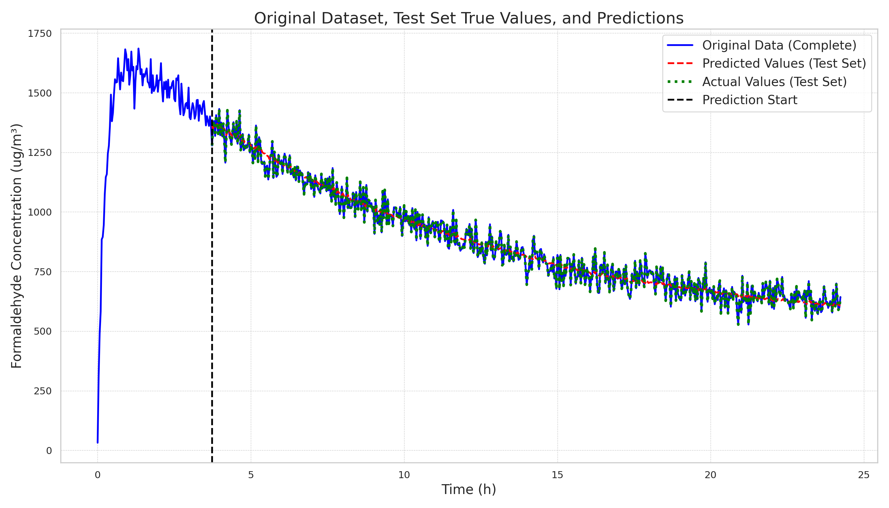 | 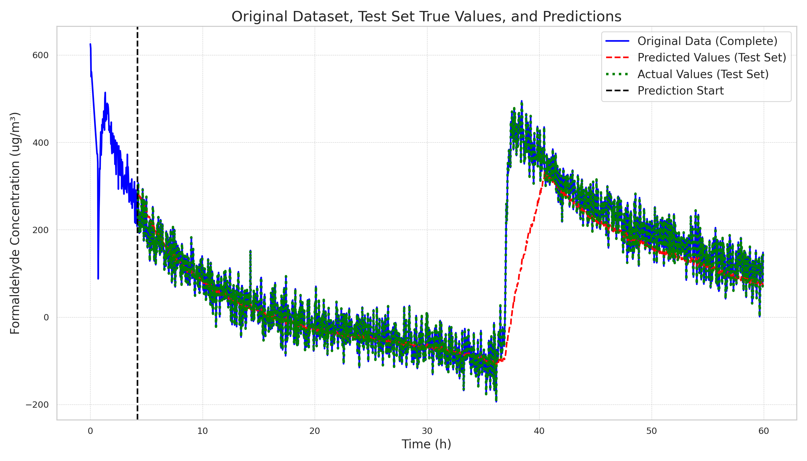 |
| Regressive |  |  |  |

```bash
# CUDA_VISIBLE_DEVICES=1 python train.py \
#     train.is_align_target=True \
#     model=att_mh \
#     dataset=y_w \
#     train.learning_rate=1e-3 \
#     train.time_steps=112 \
#     train.batch_size=64

CUDA_VISIBLE_DEVICES=1 python train.py --multirun \
    train.is_align_target=True \
    model=att_mh \
    dataset=y_w \
    model.kv_heads=1,2,4,8 \
    model.is_inln=true,false \
    model.is_qln=true,false \
    model.is_kln=true,false \
    model.is_causal=true,false \
    model.is_n_pe=true,false \
    model.pe_type=none,randpe,sinpe,rope \
    train.learning_rate=3e-4 \
    train.time_steps=112 \
    train.batch_size=64
```

Found 513 event files.

| Model                                                                                                               |   Predict/mse_regressive |   Predict/mse_batch |   Final/train_loss |   Final/val_loss |
|---------------------------------------------------------------------------------------------------------------------|--------------------------|---------------------|--------------------|------------------|
| [att_mh-64-8-1-1-1-512-is_kln-is_causal-sinpe](./logs/att_mh_y_w_ts112_lr0.0003/2025-01-10-23-15-54)                |                  1082.98 |             1088.57 |          0.0263789 |        0.022272  |
| [att_mh-64-8-8-1-1-512-is_qln-is_kln-is_causal-sinpe](./logs/att_mh_y_w_ts112_lr0.0003/2025-01-10-23-39-10)         |                  1128.91 |             1112.06 |          0.0174362 |        0.0158412 |
| [att_mh-64-8-8-1-1-512-is_kln-is_causal-sinpe](./logs/att_mh_y_w_ts112_lr0.0003/2025-01-10-23-41-01)                |                  1132.56 |             1103.78 |          0.0175932 |        0.0155773 |
| [att_mh-64-8-8-1-1-512-is_inln-is_kln-is_causal-sinpe](./logs/att_mh_y_w_ts112_lr0.0003/2025-01-10-23-37-17)        |                  1171.78 |             1110.99 |          0.019602  |        0.0169783 |
| [att_mh-64-8-4-1-1-512-is_inln-is_qln-is_kln-is_causal-sinpe](./logs/att_mh_y_w_ts112_lr0.0003/2025-01-10-23-26-38) |                  1243.07 |             1128.1  |          0.0207171 |        0.0178645 |
| [att_mh-64-8-2-1-1-512-is_inln-is_qln-is_kln-sinpe](./logs/att_mh_y_w_ts112_lr0.0003/2025-01-10-23-18-35)           |                  1271.66 |             1176.22 |          0.0200242 |        0.0161758 |
| [att_mh-64-8-2-1-1-512-is_causal-sinpe](./logs/att_mh_y_w_ts112_lr0.0003/2025-01-10-23-25-34)                       |                  1445.84 |             1173.27 |          0.0186088 |        0.0165086 |
| [att_mh-64-8-8-1-1-512-is_inln-is_qln-is_causal-sinpe](./logs/att_mh_y_w_ts112_lr0.0003/2025-01-10-23-36-18)        |                  1457.52 |             1168.32 |          0.0187448 |        0.0170224 |
| [att_mh-64-8-8-1-1-512-is_inln-is_qln-is_kln-sinpe](./logs/att_mh_y_w_ts112_lr0.0003/2025-01-10-23-35-49)           |                  1470.98 |             1211.79 |          0.0195151 |        0.0162537 |
| [att_mh-64-8-4-1-1-512-is_inln-sinpe](./logs/att_mh_y_w_ts112_lr0.0003/2025-01-10-23-30-31)                         |                  1497.7  |             1201.43 |          0.0180198 |        0.0162832 |

| param           |   avg_rank |   count |
|-----------------|------------|---------|
| pe_type=sinpe   |    173.492 |     128 |
| is_causal=True  |    191.537 |     257 |
| pe_type=rope    |    241.527 |     129 |
| kv_heads=1      |    244.594 |     128 |
| kv_heads=2      |    256.625 |     128 |
| is_kln=True     |    257.825 |     257 |
| kv_heads=4      |    259.461 |     128 |
| kv_heads=8      |    263.264 |     129 |
| is_qln=True     |    269.669 |     257 |
| pe_type=none    |    298.125 |     128 |
| is_n_pe=True    |    305.848 |     257 |
| pe_type=randpe  |    310.969 |     128 |
| is_inln=True    |    313.304 |     257 |

| param                        |   avg_rank |   count |
|------------------------------|------------|---------|
| is_causal=True,pe_type=sinpe |    122.781 |      64 |
| kv_heads=1,pe_type=sinpe     |    162.812 |      32 |
| is_qln=True,pe_type=sinpe    |    171.219 |      64 |
| kv_heads=2,pe_type=sinpe     |    174.656 |      32 |
| is_causal=True,pe_type=rope  |    174.954 |      65 |
| kv_heads=4,pe_type=sinpe     |    176.844 |      32 |
| is_kln=True,pe_type=sinpe    |    176.969 |      64 |
| kv_heads=8,pe_type=sinpe     |    179.656 |      32 |
| kv_heads=1,is_causal=True    |    185.906 |      64 |
| is_qln=True,is_causal=True   |    187.814 |     129 |

| param                                    |   avg_rank |   count |
|------------------------------------------|------------|---------|
| is_qln=True,is_causal=True,pe_type=sinpe |    119.812 |      32 |
| kv_heads=4,is_causal=True,pe_type=sinpe  |    121.375 |      16 |
| kv_heads=1,is_causal=True,pe_type=sinpe  |    121.75  |      16 |
| is_kln=True,is_causal=True,pe_type=sinpe |    123.375 |      32 |
| kv_heads=8,is_causal=True,pe_type=sinpe  |    123.5   |      16 |
| kv_heads=2,is_causal=True,pe_type=sinpe  |    124.5   |      16 |
| kv_heads=1,is_kln=True,pe_type=sinpe     |    153.188 |      16 |
| kv_heads=1,is_causal=True,pe_type=rope   |    164.5   |      16 |
| kv_heads=1,is_qln=True,pe_type=sinpe     |    165.5   |      16 |
| kv_heads=4,is_causal=True,pe_type=rope   |    166.625 |      16 |

### vq

| Method\Testset | y_w | w_y | 4single |
|----------------|-----|-----|---------|
| Batch | 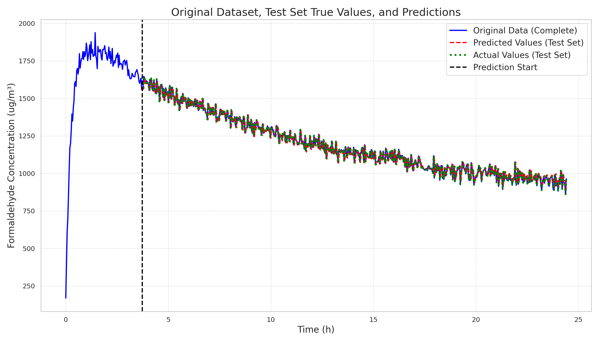 | 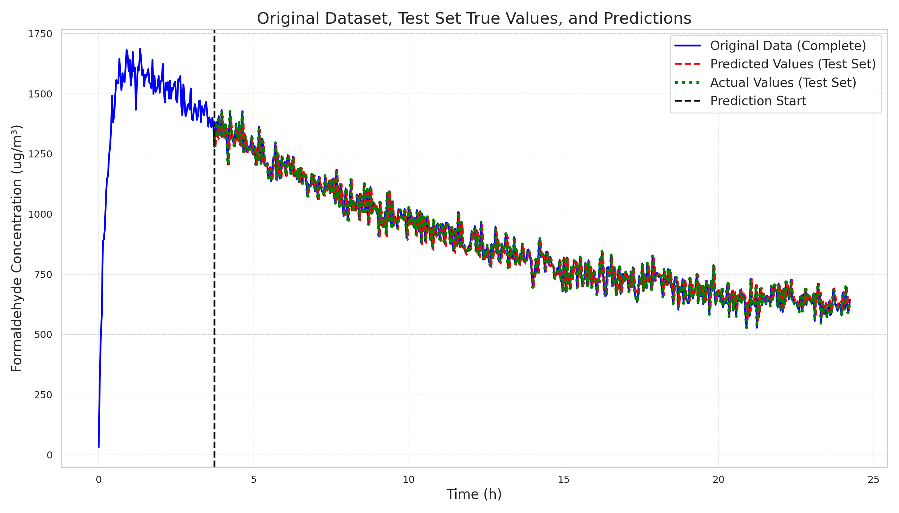 | 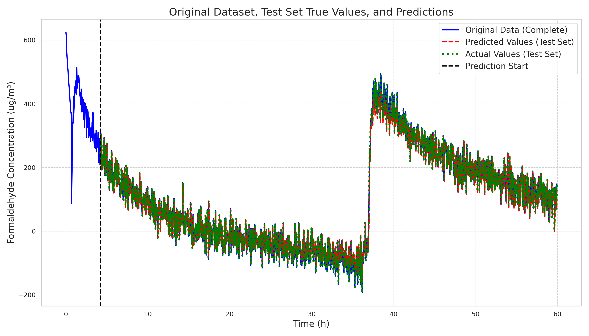 |
| Regressive |  | 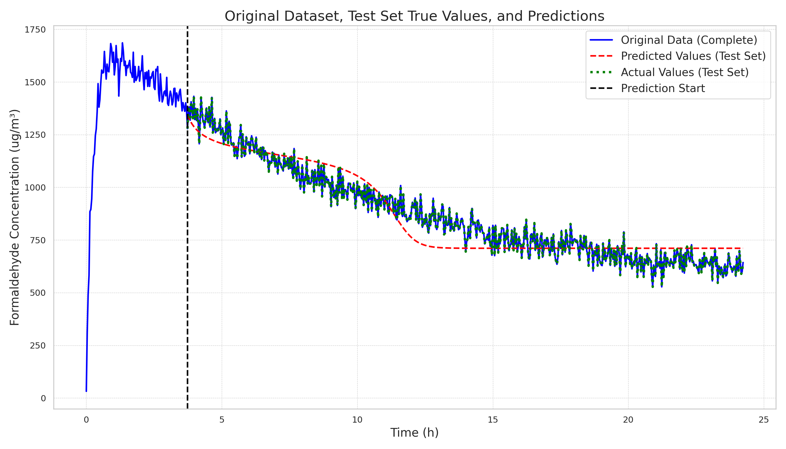 |  |

```bash
# CUDA_VISIBLE_DEVICES=2 python train.py \
#     train.is_align_target=True \
#     model=vq \
#     dataset=y_w \
#     train.learning_rate=5e-4 \
#     train.time_steps=112 \
#     train.batch_size=64

CUDA_VISIBLE_DEVICES=2 python train.py --multirun \
    train.is_align_target=True \
    model=vq \
    dataset=y_w \
    model.vocab_size=32,64,128,256\
    model.is_inln=true,false \
    model.is_causal=true,false \
    model.pe_type=none,randpe,sinpe,rope \
    train.learning_rate=3e-3,1e-3,5e-4 \
    train.time_steps=112 \
    train.batch_size=64
```

Found 193 event files.

| Model                                                                                       |   Predict/mse_regressive |   Predict/mse_batch |   Final/train_loss |   Final/val_loss |
|---------------------------------------------------------------------------------------------|--------------------------|---------------------|--------------------|------------------|
| [vq-64-64-1-1-512-is_causal-randpe](./logs/vq_y_w_ts112_lr0.001/2025-01-10-23-17-38)        |                  5500.62 |             1939.85 |          0.0558571 |        0.053299  |
| [vq-256-64-1-1-512-is_inln-is_causal-rope](./logs/vq_y_w_ts112_lr0.003/2025-01-10-23-21-35) |                  6661.47 |             1906.26 |          0.0401061 |        0.037748  |
| [vq-64-64-1-1-512-randpe](./logs/vq_y_w_ts112_lr0.0005/2025-01-10-23-18-17)                 |                  6902.28 |             1961.06 |          0.027037  |        0.0265578 |
| [vq-128-64-1-1-512-randpe](./logs/vq_y_w_ts112_lr0.003/2025-01-10-23-20-39)                 |                  8027.28 |             1956.75 |          0.026871  |        0.0264279 |
| [vq-128-64-1-1-512-randpe](./logs/vq_y_w_ts112_lr0.001/2025-01-10-23-20-42)                 |                 10081.2  |             1963.1  |          0.027078  |        0.0265915 |
| [vq-128-64-1-1-512-none](./logs/vq_y_w_ts112_lr0.0005/2025-01-10-23-20-37)                  |                 11248.5  |             1970.59 |          0.0271856 |        0.0266585 |
| [vq-256-64-1-1-512-randpe](./logs/vq_y_w_ts112_lr0.001/2025-01-10-23-23-11)                 |                 11335.7  |             1959.87 |          0.0270006 |        0.0265176 |
| [vq-32-64-1-1-512-is_causal-none](./logs/vq_y_w_ts112_lr0.001/2025-01-10-23-14-57)          |                 11469.7  |             1983.54 |          0.0495915 |        0.0470296 |
| [vq-256-64-1-1-512-randpe](./logs/vq_y_w_ts112_lr0.0005/2025-01-10-23-23-14)                |                 11498.4  |             1968.76 |          0.0271431 |        0.0266244 |
| [vq-256-64-1-1-512-randpe](./logs/vq_y_w_ts112_lr0.003/2025-01-10-23-23-09)                 |                 12181.5  |             1956.7  |          0.0268831 |        0.0264323 |

| param           |   avg_rank |   count |
|-----------------|------------|---------|
| vocab_size=256  |    80.9583 |      48 |
| pe_type=rope    |    88.7551 |      49 |
| pe_type=randpe  |    89.2917 |      48 |
| vocab_size=128  |    89.625  |      48 |
| is_causal=True  |    95.0103 |      97 |
| pe_type=sinpe   |   101.062  |      48 |
| pe_type=none    |   105.042  |      48 |
| vocab_size=32   |   105.082  |      49 |
| vocab_size=64   |   108.146  |      48 |
| is_inln=True    |   124.031  |      97 |

| param                         |   avg_rank |   count |
|-------------------------------|------------|---------|
| vocab_size=256,pe_type=rope   |    66.5    |      12 |
| vocab_size=256,is_causal=True |    68.9167 |      24 |
| vocab_size=256,pe_type=randpe |    80.3333 |      12 |
| vocab_size=128,pe_type=sinpe  |    84.6667 |      12 |
| vocab_size=128,pe_type=randpe |    84.8333 |      12 |
| vocab_size=128,pe_type=none   |    85.0833 |      12 |
| vocab_size=32,pe_type=rope    |    85.3077 |      13 |
| vocab_size=64,pe_type=randpe  |    85.8333 |      12 |
| vocab_size=256,pe_type=none   |    87.25   |      12 |
| vocab_size=128,is_causal=True |    88.2917 |      24 |

| param                                        |   avg_rank |   count |
|----------------------------------------------|------------|---------|
| vocab_size=256,is_causal=True,pe_type=rope   |    56.3333 |       6 |
| vocab_size=256,is_causal=True,pe_type=sinpe  |    63.6667 |       6 |
| vocab_size=128,is_causal=True,pe_type=randpe |    69.8333 |       6 |
| vocab_size=256,is_causal=True,pe_type=none   |    72.5    |       6 |
| vocab_size=256,is_inln=True,pe_type=sinpe    |    81.8333 |       6 |
| vocab_size=128,is_inln=True,pe_type=sinpe    |    82.8333 |       6 |
| vocab_size=256,is_causal=True,pe_type=randpe |    83.1667 |       6 |
| vocab_size=128,is_causal=True,pe_type=none   |    86.3333 |       6 |
| vocab_size=32,is_causal=True,pe_type=rope    |    86.5714 |       7 |
| vocab_size=256,is_inln=True,pe_type=rope     |    88      |       6 |

### vq_mh

| Method\Testset | y_w | w_y | 4single |
|----------------|-----|-----|---------|
| Batch | 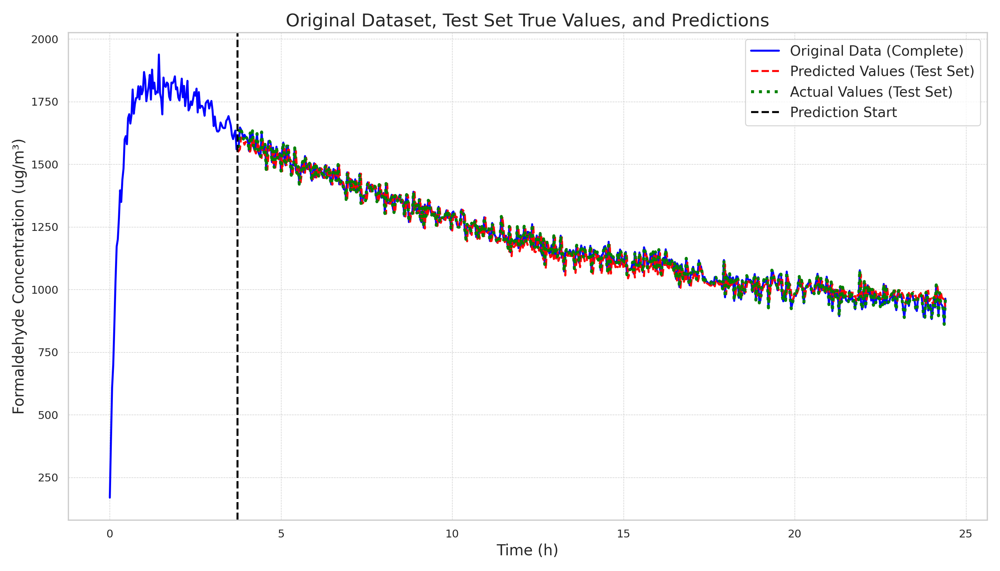 | 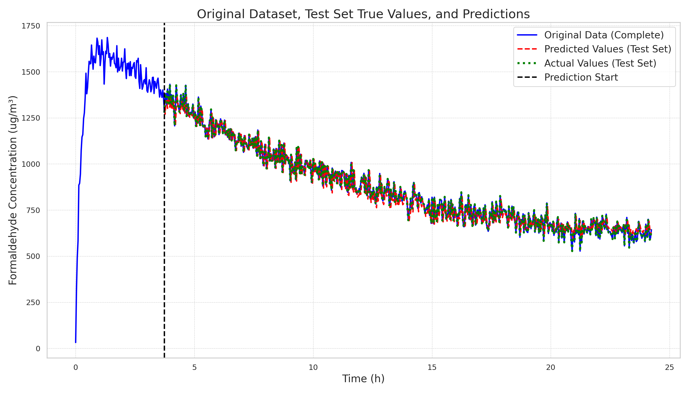 | 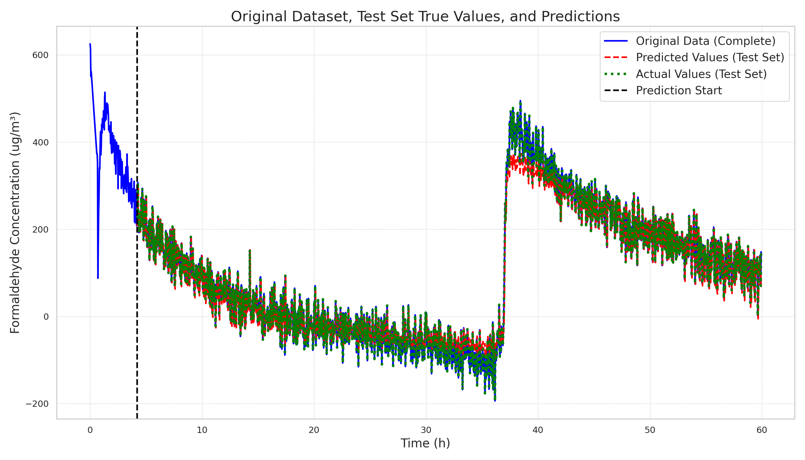 |
| Regressive | 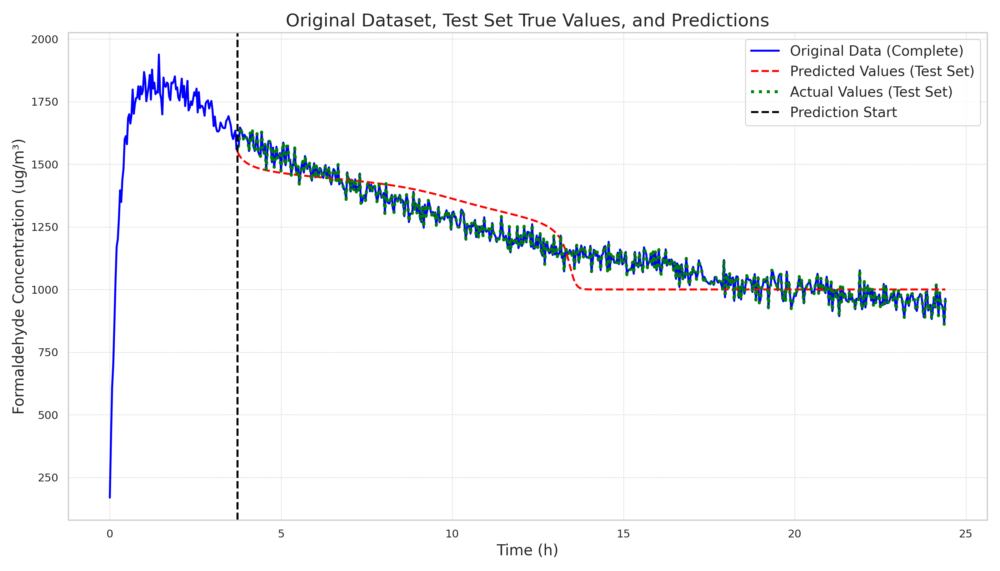 |  | 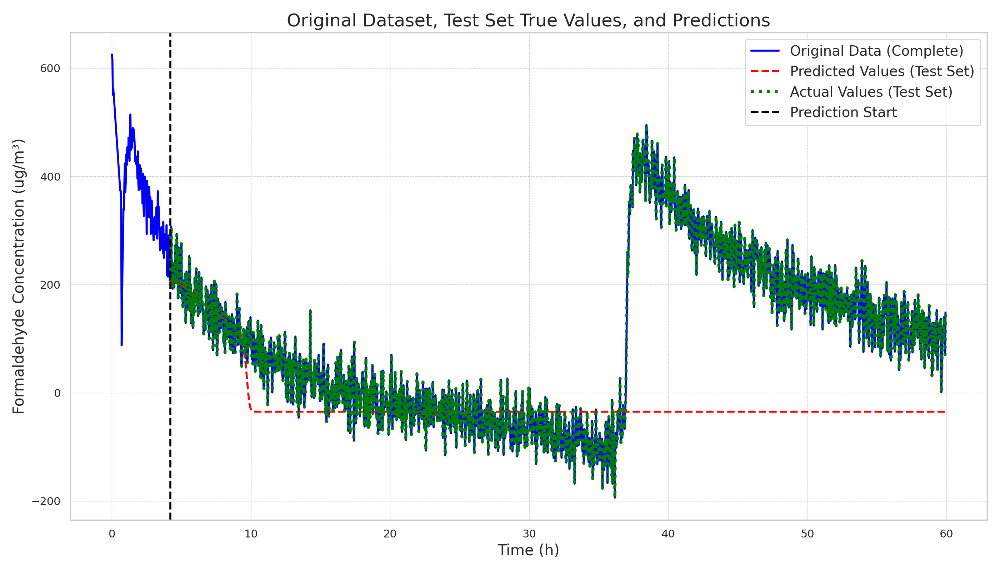 |


```bash
# CUDA_VISIBLE_DEVICES=3 python train.py \
#     train.is_align_target=True \
#     model=vq_mh \
#     dataset=y_w \
#     train.learning_rate=5e-4 \
#     train.time_steps=112 \
#     train.batch_size=64

CUDA_VISIBLE_DEVICES=3 python train.py --multirun \
    train.is_align_target=True \
    model=vq_mh \
    dataset=y_w \
    model.vocab_size=32,64,128,256\
    model.kv_heads=1,2,4,8 \
    model.is_inln=true,false \
    model.is_qln=true,false \
    model.is_causal=true,false \
    model.is_n_pe=true,false \
    model.pe_type=sinpe,rope \
    train.learning_rate=3e-3,1e-3,5e-4 \
    train.time_steps=112 \
    train.batch_size=64
```

Found 1537 event files.

| Model                                                                                                                 |   Predict/mse_regressive |   Predict/mse_batch |   Final/train_loss |   Final/val_loss |
|-----------------------------------------------------------------------------------------------------------------------|--------------------------|---------------------|--------------------|------------------|
| [vq_mh-64-64-8-4-1-1-218-is_inln-is_n_pe-rope](./logs/vq_mh_y_w_ts112_lr0.003/2025-01-11-00-01-54)                    |                  5904.3  |             1936.46 |          0.0269556 |        0.0266874 |
| [vq_mh-128-64-8-2-1-1-218-is_qln-is_causal-sinpe](./logs/vq_mh_y_w_ts112_lr0.003/2025-01-11-00-20-50)                 |                  7507.54 |             1995.17 |          0.03632   |        0.0348336 |
| [vq_mh-64-64-8-1-1-1-218-is_inln-is_n_pe-rope](./logs/vq_mh_y_w_ts112_lr0.003/2025-01-10-23-49-47)                    |                  7557.85 |             1970.69 |          0.0271267 |        0.0268569 |
| [vq_mh-128-64-8-2-1-1-218-is_qln-is_causal-is_n_pe-sinpe](./logs/vq_mh_y_w_ts112_lr0.003/2025-01-11-00-20-26)         |                  8151.63 |             1940.45 |          0.0367579 |        0.0346867 |
| [vq_mh-128-64-8-4-1-1-218-is_inln-is_causal-is_n_pe-rope](./logs/vq_mh_y_w_ts112_lr0.003/2025-01-11-00-25-10)         |                  8530.85 |             1935.74 |          0.0358093 |        0.034199  |
| [vq_mh-256-64-8-4-1-1-218-is_inln-is_qln-is_n_pe-sinpe](./logs/vq_mh_y_w_ts112_lr0.003/2025-01-11-00-48-32)           |                  8610.5  |             1975.65 |          0.0274611 |        0.0270697 |
| [vq_mh-32-64-8-1-1-1-218-is_n_pe-sinpe](./logs/vq_mh_y_w_ts112_lr0.003/2025-01-10-23-28-43)                           |                  8778.86 |             1987.54 |          0.0274843 |        0.0268307 |
| [vq_mh-128-64-8-4-1-1-218-is_inln-is_qln-is_causal-is_n_pe-sinpe](./logs/vq_mh_y_w_ts112_lr0.003/2025-01-11-00-23-26) |                  9496.51 |             2053.04 |          0.0368602 |        0.0351689 |
| [vq_mh-256-64-8-2-1-1-218-is_inln-is_causal-rope](./logs/vq_mh_y_w_ts112_lr0.003/2025-01-11-00-43-48)                 |                  9965.92 |             1911.16 |          0.0363591 |        0.0345622 |
| [vq_mh-128-64-8-4-1-1-218-is_qln-is_n_pe-sinpe](./logs/vq_mh_y_w_ts112_lr0.001/2025-01-11-00-27-18)                   |                 10156.7  |             1945.94 |          0.0316787 |        0.0303782 |

| param           |   avg_rank |   count |
|-----------------|------------|---------|
| pe_type=rope    |    683.876 |     769 |
| vocab_size=256  |    710.214 |     384 |
| vocab_size=128  |    730.151 |     384 |
| kv_heads=8      |    747.966 |     384 |
| kv_heads=4      |    752.385 |     384 |
| is_n_pe=True    |    762.757 |     769 |
| is_causal=True  |    773.7   |     769 |
| kv_heads=1      |    783.974 |     384 |
| kv_heads=2      |    787.623 |     385 |
| vocab_size=64   |    789.047 |     384 |
| is_qln=True     |    838.459 |     769 |
| vocab_size=32   |    842.395 |     385 |
| pe_type=sinpe   |    852.233 |     768 |
| is_inln=True    |    888.085 |     769 |

| param                         |   avg_rank |   count |
|-------------------------------|------------|---------|
| vocab_size=256,pe_type=rope   |    637.51  |     192 |
| kv_heads=8,pe_type=rope       |    669.333 |     192 |
| vocab_size=128,kv_heads=4     |    669.385 |      96 |
| kv_heads=4,pe_type=rope       |    670.776 |     192 |
| vocab_size=128,pe_type=rope   |    677.312 |     192 |
| is_n_pe=True,pe_type=rope     |    682.766 |     385 |
| vocab_size=256,kv_heads=2     |    683.177 |      96 |
| vocab_size=256,is_n_pe=True   |    686.667 |     192 |
| kv_heads=2,pe_type=rope       |    688.984 |     193 |
| vocab_size=256,is_causal=True |    690.682 |     192 |

| param                                    |   avg_rank |   count |
|------------------------------------------|------------|---------|
| vocab_size=256,kv_heads=1,pe_type=rope   |    611.375 |      48 |
| vocab_size=256,kv_heads=2,pe_type=rope   |    621.729 |      48 |
| vocab_size=256,kv_heads=2,is_n_pe=True   |    628     |      48 |
| vocab_size=256,is_n_pe=True,pe_type=rope |    628.635 |      96 |
| vocab_size=128,kv_heads=4,is_causal=True |    631.083 |      48 |
| vocab_size=256,kv_heads=2,is_causal=True |    632.062 |      48 |
| kv_heads=4,is_n_pe=True,pe_type=rope     |    635.719 |      96 |
| vocab_size=256,kv_heads=8,pe_type=rope   |    638.646 |      48 |
| vocab_size=128,kv_heads=4,pe_type=rope   |    640.333 |      48 |
| vocab_size=32,kv_heads=8,pe_type=rope    |    646.875 |      48 |
